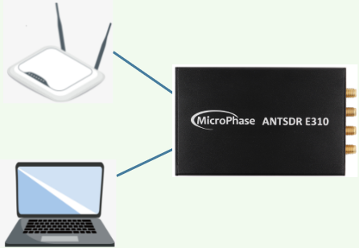
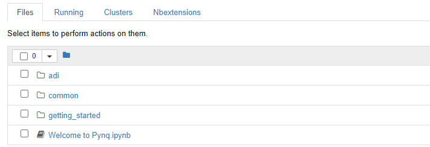
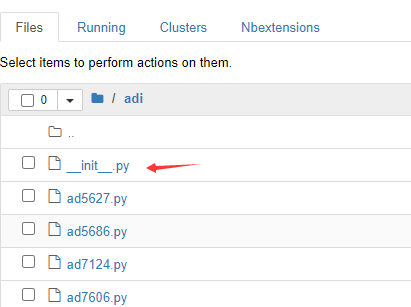
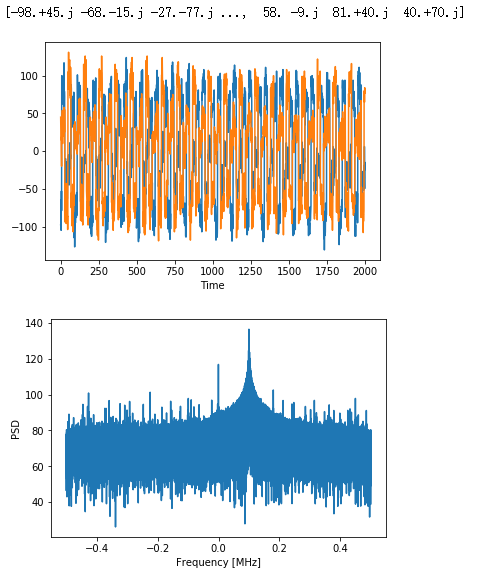

# PYNQ Framework for ANTSDR


This project  was inspired by [PYNQ](https://github.com/Xilinx/PYNQ) and  [PlutoSDR](https://github.com/analogdevicesinc/plutosdr-fw.git).  There are already many SDR platforms based on ZYNQ and AD9361,  so does ANTSDR.

When we saw the [PYNQ_RFSOC](https://github.com/Xilinx/PYNQ_RFSOC_Workshop), we thought PYNQ might also be a good SDR Framework.  Due to the high price of RFSOC, we think we can make a product with similar functions based on ANTSDR.

Finally, we  transplanted PYNQ framework into ANTSDR successfully. Through the python binding of [libiio](https://github.com/analogdevicesinc/libiio.git) and python interface [pyadi-iio](https://github.com/analogdevicesinc/pyadi-iio.git) provided by [ADI](https://www.analog.com/en/index.html), we can use PYNQ to interact with AD9361.  Although the performance of ZYNQ7020+AD9361 may not be the same as RFSoC, it is also a good attempt for us.

## Build instruction 

In this section, I will briefly introduce how to make PYNQ SD card Image for ANTSDR. For detail information, please refer to [PYNQ SD card](https://pynq.readthedocs.io/en/latest/pynq_sd_card.html).

- Pre-conditions:
	- Host computer: Ubuntu16.04 LTS ( this is the tested version)
	-  Vivado 2018.3 (intall path /opt/Xilinx)
	-  petalinux 2018.3 (intall path /opt/pkg/petalinux/2018.3)
	-  PYNQ branch image_v2.4
  
	You should install the required software into the corresponding path .


- Set up the host
	```bash
	git clone --recursive https://github.com/MicroPhase/antsdr-pynq.git
	cd antsdr-pynq/pynq/sdbuild/scripts/
	./setup_host.sh
	```
	This will take a few minutes to setup the host environment. After it finished, you will the the  **quem** and **crosstool-ng** folder in  /opt .

	```bash
	wcc@wcc-dev:/opt$ ls -l /opt/
	total 32
	drwxr-xr-x 6 root root 4096 1月   7  2020 crosstool-ng
	drwxr-xr-x 3 wcc  wcc  4096 1月   4  2020 pkg
	drwxr-xr-x 6 root root 4096 1月   7  2020 qemu
	drwxrwxrwx 6 wcc  wcc  4096 1月   7  2020 Xilinx
	```

- Build the SD card Image
  
  Now you can build the image from scratch, you can either build from source code or build from offline root file system. I would recommend the second way.
	- Build from offline rootfs 
	You can download the offline PYNQ rootfs from this link: https://www.xilinx.com/member/forms/download/xef.html?filename=pynq_rootfs_arm_v2.4.zip.
	You can unzip this file to a folder and start to build the image. For example
        ```bash
        mkdir sdbuild/prebuilt
        unzip -d  sdbuild/prebuilt  pynq_rootfs_arm_v2.4.zip
        cd sdbuild
        cp -r  ../../antsdr  ../boards/
        make BOARDS=antsdr  PREBUILT=./prebuilt/bionic.arm.2.4.img
        ```
	- Build from source code
        ```bash
        cd sdbuild
        make BOARDS=antsdr
        ```
	You can find the output image **antsdr-2.4.img** in the **sdbuild/output** folder.

- Trouble shutting
  - if the result returns a environment error, this could be caused by the petalinux environment settings.<br>
  you should configure the dash.
  ```
    sudo dpkg-reconfigure dash    
    (then choose no)
  ```

## Setup the PYNQ for antsdr

Once you have finished building the image, you can let ANTSDR to become a  PYNQ  SDR.

- Burn the image into  a SD card
	- In linux
		```bash
		sudo dd if=sdbuild/output/ANTSDR-2.4.img of=/dev/sdb bs=4M
		```
	- In windows
	you can use win32diskmanger or other software to burn the sd card.

- Boot up antsdr 

You should insert the SD card into antsdr, connect antsdr to the router with a network cable(the antsdr needs to acess to the internet for building libiio from source), connect to the serial port of antsdr and computer with usb, and power on.



From the serial port terminal, you can see the printed information about PYNQ startup.

Once the PYNQ boot up, you can interact with antsdr through serial port.
```
xilinx@pynq:~$ ls
jupyter_notebooks  pynq  REVISION
xilinx@pynq:~$ ifconfig
eth0: flags=4163<UP,BROADCAST,RUNNING,MULTICAST>  mtu 1500
        inet 192.168.3.226  netmask 255.255.255.0  broadcast 192.168.3.255
        ether 6a:c7:37:d0:cd:8a  txqueuelen 1000  (Ethernet)
        RX packets 4305  bytes 3915132 (3.9 MB)
        RX errors 0  dropped 0  overruns 0  frame 0
        TX packets 2803  bytes 240798 (240.7 KB)
        TX errors 0  dropped 0 overruns 0  carrier 0  collisions 0
        device interrupt 29  base 0xb000

eth0:1: flags=4163<UP,BROADCAST,RUNNING,MULTICAST>  mtu 1500
        inet 192.168.2.99  netmask 255.255.255.0  broadcast 192.168.2.255
        ether 6a:c7:37:d0:cd:8a  txqueuelen 1000  (Ethernet)
        device interrupt 29  base 0xb000

lo: flags=73<UP,LOOPBACK,RUNNING>  mtu 65536
        inet 127.0.0.1  netmask 255.0.0.0
        loop  txqueuelen 1000  (Local Loopback)
        RX packets 726  bytes 74719 (74.7 KB)
        RX errors 0  dropped 0  overruns 0  frame 0
        TX packets 726  bytes 74719 (74.7 KB)
        TX errors 0  dropped 0 overruns 0  carrier 0  collisions 0

xilinx@pynq:~$
```
You need to connect the ethernet cable to a router, the following steps will needs antsdr to have an access to network.

## Python bonding for libiio

You can refer  this link to build the python bonding for libiio: [python bonding for libiio](https://github.com/analogdevicesinc/libiio/blob/master/README_BUILD.md)

**NOTE:** these instructions below will be running on antsdr. The password for sudo is **xilinx**
- Install Prerequisites/Dependencies
  ```bash
  sudo apt-get update
  sudo apt-get install build-essential
  sudo apt-get install libxml2-dev bison flex libcdk5-dev cmake
  sudo apt-get install libaio-dev libusb-1.0-0-dev
  sudo apt-get install libserialport-dev libavahi-client-dev
  sudo apt-get install doxygen graphviz
  sudo apt-get install python3 python3-pip python3-setuptools
  ```
- Install to Read local context attributes from /etc/libiio.ini
  ```bash
  git clone https://github.com/pcercuei/libini.git
  cd libini
  mkdir build && cd build && cmake ../ && make && sudo make install
  cd ~
  ```
- Install libiio and pylibiio
  ```bash
  git clone https://github.com/analogdevicesinc/libiio.git
  cd libiio
  cmake ./
  make all -j$(nproc)
  sudo make install
  sudo ldconfig
  cd bindings/python/
  sudo python3 setup.py.cmakein install
  cd ~
  ```
  If the libiio is installed, you can use **iio_info** to get the information of iio devices.
  ```
  xilinx@pynq:~$ iio_info
  Library version: 0.23 (git tag: c14a0f8)
  Compiled with backends: local xml ip usb
  IIO context created with local backend.
  Backend version: 0.23 (git tag: c14a0f8)
  Backend description string: Linux pynq 4.14.0-xilinx- #1 SMP PREEMPT Thu Sep 2 06:07:03 UTC 2021 armv7l
  IIO context has 2 attributes:
          local,kernel: 4.14.0-xilinx-
          uri: local:
  IIO context has 5 devices:
          iio:device0: ad9361-phy
  ......
  ......
  ......
  ```

- clone pyadi-iio and move adi folder into jupter note book
  ```bash
  git clone https://github.com/analogdevicesinc/pyadi-iio.git
  cp -r pyadi-iio/adi jupyter_notebooks
  ```

## Interact AD9361 using jupyter_notebooks  

Now, open your web browser and acess to the antsdr. First, let's get the ip address of antsdr.
```
eth0: flags=4163<UP,BROADCAST,RUNNING,MULTICAST>  mtu 1500
        inet 192.168.3.226  netmask 255.255.255.0  broadcast 192.168.3.255
        ether 6a:c7:37:d0:cd:8a  txqueuelen 1000  (Ethernet)
        RX packets 27542  bytes 34260194 (34.2 MB)
        RX errors 0  dropped 0  overruns 0  frame 0
        TX packets 19276  bytes 1545616 (1.5 MB)
        TX errors 0  dropped 0 overruns 0  carrier 0  collisions 0
        device interrupt 29  base 0xb000

eth0:1: flags=4163<UP,BROADCAST,RUNNING,MULTICAST>  mtu 1500
        inet 192.168.2.99  netmask 255.255.255.0  broadcast 192.168.2.255
        ether 6a:c7:37:d0:cd:8a  txqueuelen 1000  (Ethernet)
        device interrupt 29  base 0xb000

lo: flags=73<UP,LOOPBACK,RUNNING>  mtu 65536
        inet 127.0.0.1  netmask 255.0.0.0
        loop  txqueuelen 1000  (Local Loopback)
        RX packets 765  bytes 77367 (77.3 KB)
        RX errors 0  dropped 0  overruns 0  frame 0
        TX packets 765  bytes 77367 (77.3 KB)
        TX errors 0  dropped 0 overruns 0  carrier 0  collisions 0
```
As you can see, there are 2 ip address for the ethernet port, the first one is the dynamic IP address if antsdr are connected to a router.
The second one is the static IP address for antsdr.

If you use the first ip address, to access the antsdr, you should type the ip address in your browser, by dynamic IP or static IP,
for example:192.168.3.229:9090  for dynamic IP 
or 192.168.2.99 for static IP(ethernet cable should connect directly to the computer).

By default, the password is **xilinx**.


Then we can see the jupyter notebook,  we need a little modifications to use the adi package.change the **adi/\__init\__.py** file. comment other package besides ad936x.



```py
from adi.ad936x import ad9361, ad9363, ad9364, Pluto

from adi.fmcomms5 import FMComms5

# from adi.ad9371 import ad9371

# from adi.adrv9002 import adrv9002

# from adi.adrv9009 import adrv9009

# from adi.adrv9009_zu11eg import adrv9009_zu11eg

# from adi.adrv9009_zu11eg_multi import adrv9009_zu11eg_multi

# from adi.adrv9009_zu11eg_fmcomms8 import adrv9009_zu11eg_fmcomms8

# from adi.ad9081 import ad9081

# from adi.ad9081_mc import ad9081_mc, QuadMxFE

# from adi.ad9083 import ad9083

# from adi.ad9094 import ad9094

# from adi.ad9680 import ad9680

# from adi.ad9136 import ad9136

# from adi.ad9144 import ad9144

# from adi.ad9152 import ad9152

# from adi.cn0532 import cn0532

# from adi.daq2 import DAQ2

# from adi.daq3 import DAQ3

# from adi.adis16460 import adis16460

# from adi.adis16507 import adis16507

# from adi.ad7124 import ad7124

# from adi.adxl345 import adxl345

# from adi.adxrs290 import adxrs290

# from adi.fmclidar1 import fmclidar1

# from adi.ad5686 import ad5686

# from adi.adar1000 import adar1000, adar1000_array

# from adi.ltc2983 import ltc2983

# from adi.one_bit_adc_dac import one_bit_adc_dac

# from adi.ltc2314_14 import ltc2314_14

# from adi.ad7606 import ad7606

# from adi.ad7799 import ad7799

# from adi.ad7746 import ad7746

# from adi.adpd410x import adpd410x

# from adi.ad7689 import ad7689

# from adi.adf4371 import adf4371

# from adi.adpd188 import adpd188

try:
    from adi.jesd import jesd
except ImportError:
    pass

__version__ = "0.0.9"
name = "Analog Devices Hardware Interfaces"
```

## Example to interact with ad9361

Now we can, write a simple script to  interact with ad9361.
This demo is originally from [PySDR](https://pysdr.org/content/pluto.html)
```py
import numpy as np
import adi
import matplotlib.pyplot as plt

sample_rate = 1e6 # Hz
center_freq = 915e6 # Hz
num_samps = 100000 # number of samples per call to rx()
tx_gain = 100

sdr = adi.ad9361(uri="local:")
sdr.sample_rate = int(sample_rate)

fc = 3000000
N = 1024
ts = 1 / 30000000.0
t = np.arange(0, N * ts, ts)
i = np.cos(2 * np.pi * t * fc) * 2 ** 14
q = np.sin(2 * np.pi * t * fc) * 2 ** 14
iq = i + 1j * q

sdr.sample_rate = int(sample_rate)
sdr.tx_lo = int(center_freq)
sdr.tx_hardware_gain_chan0 = tx_gain
sdr.tx_enabled_channels = [0]

# Config Rx
sdr.rx_lo = int(center_freq)
sdr.rx_rf_bandwidth = int(sample_rate)
sdr.rx_buffer_size = num_samps
sdr.gain_control_mode_chan0 = 'slow_attack'
sdr.rx_enabled_channels = [0]
# sdr.rx_hardwaregain_chan0 = -10.0 # dB, increase to increase the receive gain, but be careful not to saturate the ADC

sdr.tx_cyclic_buffer = True
# Send data cyclically
sdr.tx(iq)

# Clear buffer just to be safe
for i in range (0, 10):
    raw_data = sdr.rx()

# Receive samples
rx_samples = sdr.rx()
print(rx_samples)

# Stop transmitting
sdr.tx_destroy_buffer()

# Calculate power spectral density (frequency domain version of signal)
psd = np.abs(np.fft.fftshift(np.fft.fft(rx_samples)))**2
psd_dB = 10*np.log10(psd)
f = np.linspace(sample_rate/-2, sample_rate/2, len(psd))

# Plot time domain
plt.figure(0)
plt.plot(np.real(rx_samples[:200:1]))
plt.plot(np.imag(rx_samples[:200:1]))
plt.xlabel("Time")

# Plot freq domain
plt.figure(1)
plt.plot(f/1e6, psd_dB)
plt.xlabel("Frequency [MHz]")
plt.ylabel("PSD")
plt.show()
```


## Work to be done
 
 This is the first open source PYNQ project to control AD9361, as you  can see, there are still a lot of thins need to do. I am waiting for your contribution.

 - TODO
   - libiio package build into the pynq image
   -  python code for pynq demo
   -  RF performance measurement
   -  HDL project  and devicetree  improvement.(The hdl project is mainly based on fmcomms2/3/4+zed)


## Licenses

**PYNQ** License : [BSD 3-Clause License](https://github.com/Xilinx/PYNQ/blob/master/LICENSE)

**Xilinx Embedded SW** License : [Multiple License File](https://github.com/Xilinx/embeddedsw/blob/master/license.txt)

**Digilent IP** License: [MIT License](https://github.com/Xilinx/PYNQ/blob/master/THIRD_PARTY_LIC)

**ADI meta layer** License: [MIT License](https://github.com/analogdevicesinc/meta-adi/blob/master/LICENSE)

**ADI hdl** License: [Multiple License File](https://github.com/analogdevicesinc/hdl/blob/master/LICENSE)